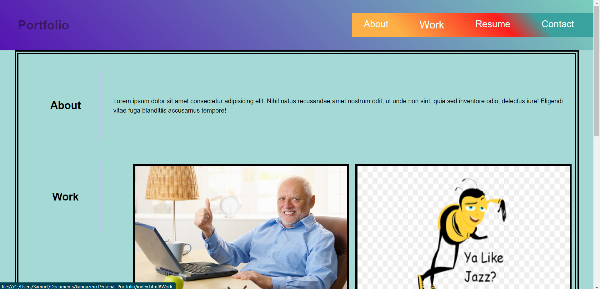
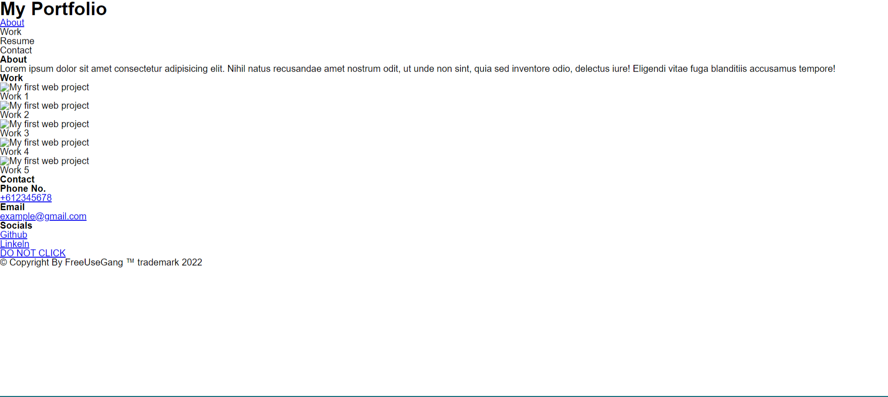
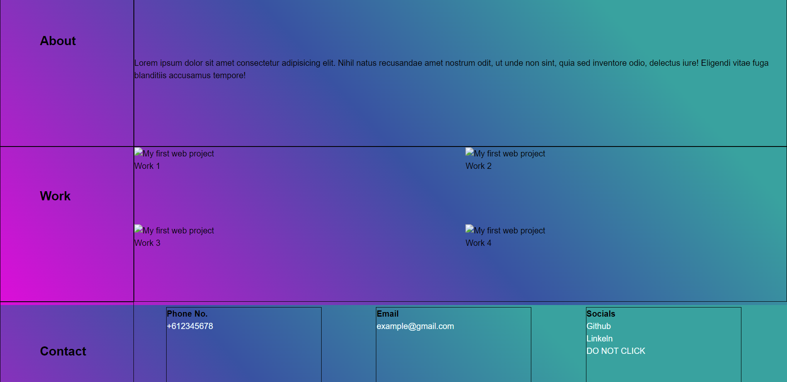
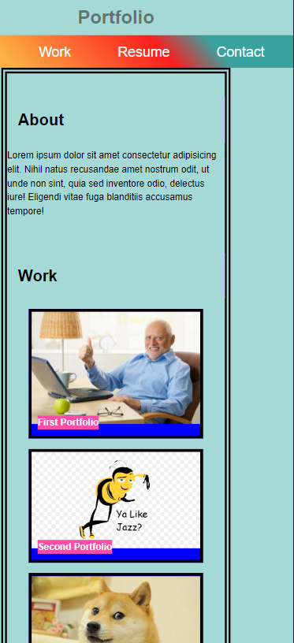

# <Personal-Portfolio>

<!-- TABLE OF CONTENTS -->

  
Table of Contents

  <ol>
    <li>
      <a href="#description">Description</a>
    </li>
    <li><a href="#roadmap">Roadmap</a></li>
    <li><a href="#license">License</a></li>
    <li><a href="#contact">Contact</a></li>
    <li><a href="#acknowledgments">Acknowledgments</a></li>
  </ol>

<!-- ABOUT THE PROJECT -->
## Description

 
Desktop View

**What?**

This is a personal portfolio website that showcases works that will be done throughout this 6-month bootcamp course. Currently it is rather basic and only ultilizes my current knowledge of HTML and CSS.  

The website can be seen as a "cover letter" that will be more interactive in the future, with multiple new linked pages and to showcase my skills and collabration with other programmers. 

**Why?**

This portfolio serves not just as an assignment but also for my whole career as a (front-end) programmer.
As of right now it only includes basic html and css, but for future, the implementation of libraries such as Node.js, bootstrap etc, as well as Javascript (and maybe a new non-existent language) will be implemented as my skills and experience increases. 

**Acquired Knowledge**

I have learnt quite a bit throughout the making of this website.
I cannot say that I have understood nor mastered any of the features implemented, however here the important bits:

- Ultising the "Display: Flex;" in CSS, and the "align-items" and "justify-content" properties in moving boxes around.
- Adding "transition" and "animation" features to links with pseudo-classes. 

(<a href="#readme-top">back to top</a>)

<!-- ROADMAP -->
## Roadmap
- [x] Basic html code 

 

Html-only

- [x] Add basic framework

Wireframe

- [x] Include Title and navigation
- [x] Main Content (About, Works, Contact)
- [x] Mobile responsive (screen-size)

Mobile view

(<a href="#readme-top">back to top</a>)

<!-- LICENSE -->
## License

Distributed under the MIT License. See `LICENSE.txt` for more information.

(<a href="#readme-top">back to top</a>)

<!-- CONTACT -->
## Contact

Samuel Wai Weng Yong - <a href="mailto:samuelyongw@gmail.com"> samuelyongw@gmail.com </a>

Project Link: [Personal-Portfolio](https://github.com/KangaZero/kangazero.Personal_Portfolio.io.git)

(<a href="#readme-top">back to top</a>)

<!-- ACKNOWLEDGMENTS -->
## Acknowledgments

Here are some of the resources used as reference to build this personal portfolio

* [Choose an Open Source License](https://choosealicense.com)
* [Malven's Flexbox Cheatsheet](https://flexbox.malven.co/)
* [CSS-gradient](https://cssgradient.io/)
* [Color-theory](https://www.invisionapp.com/inside-design/understanding-color-theory-the-color-wheel-and-finding-complementary-colors/)
* [Email-tag](https://www.w3schools.com/tags/tag_address.asp)
* [Call-tag](https://www.elegantthemes.com/blog/wordpress/call-link-html-phone-number#:~:text=Adding%20an%20HTML%20Phone%20Number%20Call%20Link%20to%20your%20Website&text=Href%3Dtel%3A%20creates%20the%20call,the%20number%20it%20will%20call.)
* [Glowing-text](https://www.w3schools.com/howto/howto_css_glowing_text.asp)

In addition to these links, I would like to acknowledge and credit the help I had from a tutor in a one-on-one session. They have helped me in making my website suited for mobile screens, and cleaned up some code. 

Here are their contact details:
- Name: Andrew Mason
- Email: <a href="mailto:amason@instructors.2u.com"> amason@instructors.2u.com </a>

(<a href="#readme-top">back to top</a>)

Thanks for reading 😄!

